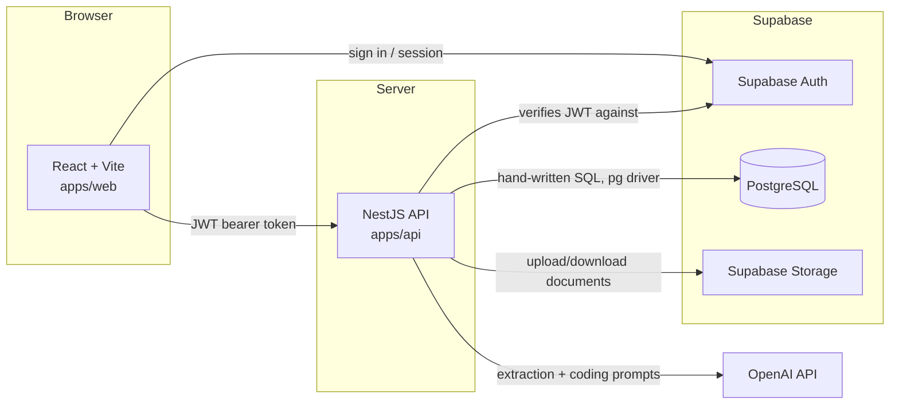
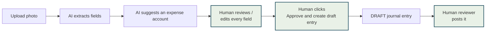

# Architecture

The API key for the AI provider and the Supabase service-role key exist only in `apps/api`'s
process environment. Neither is ever sent to the browser bundle.

## Flow 1 — posting a journal entry

1. A preparer builds lines in the journal entry screen (`apps/web/src/pages/JournalEntryFormPage.tsx`).
2. `POST /journal-entries` creates a **DRAFT** (`JournalService.createDraft`): every line is
   validated, debits and credits are summed with the `Money` class and must match exactly.
3. A reviewer calls `POST /journal-entries/:id/post` (`JournalService.post`), inside one
   database transaction:
   - the entry row is locked `FOR UPDATE`
   - the period is confirmed `OPEN`
   - debits and credits are re-verified from the database, not trusted from step 2
   - a gapless entry number is allocated under an advisory lock
   - the entry is marked `POSTED`
   - an audit row is written in the same transaction
4. A database trigger independently re-checks that the entry balances before the transaction
   commits, and a second trigger makes the row immutable from that point on — both survive
   even if the service-layer logic above has a bug.

## Flow 2 — a document from upload to a posted entry

The three highlighted steps are the only ones a human performs, and they are also the only
three steps with any authority to change the ledger. The AI's output (the two steps before
"Review") is advisory at every point — see `docs/ai-boundary.md` for how that is enforced in
code, not just in this diagram.
